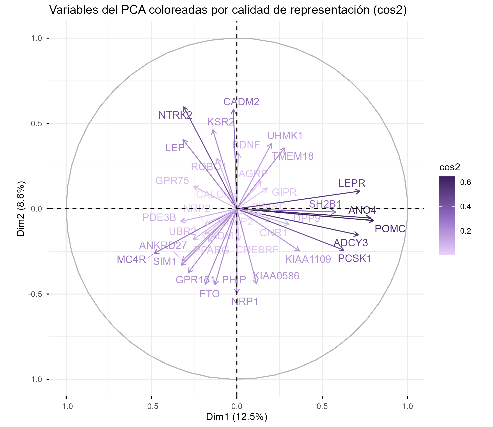
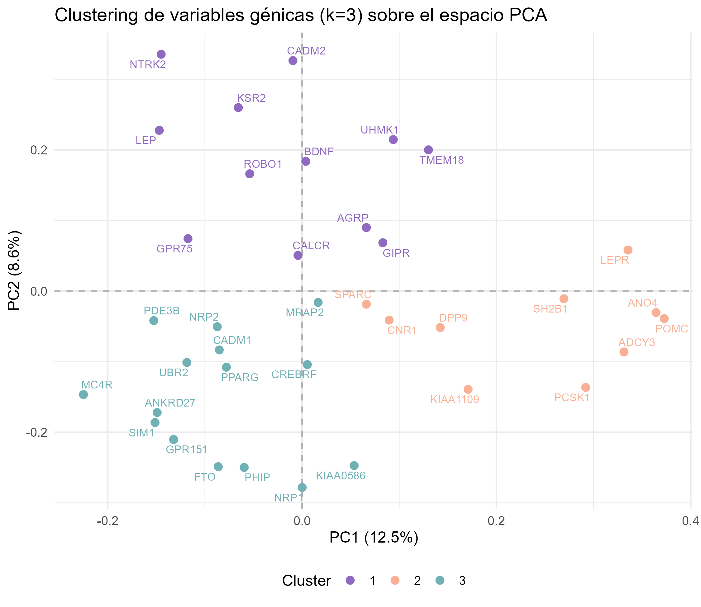
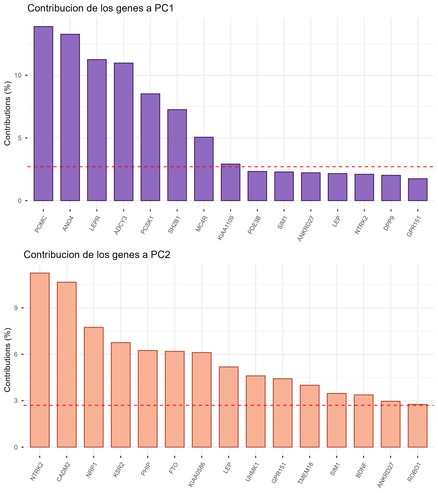
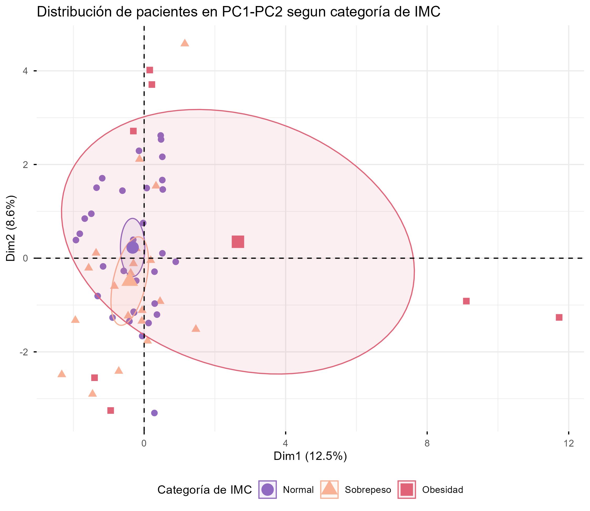
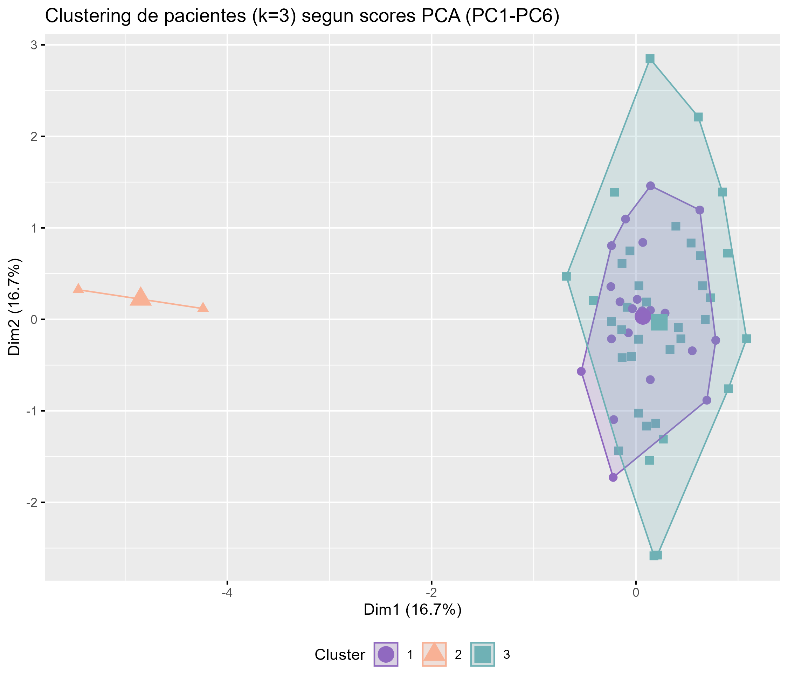
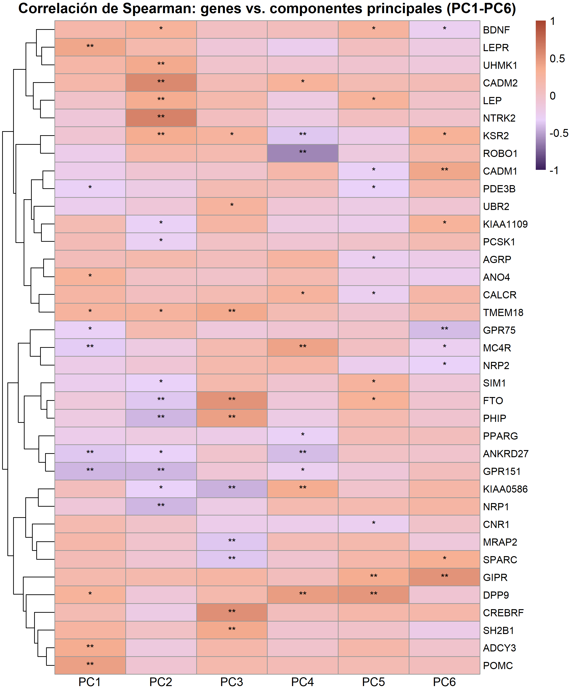
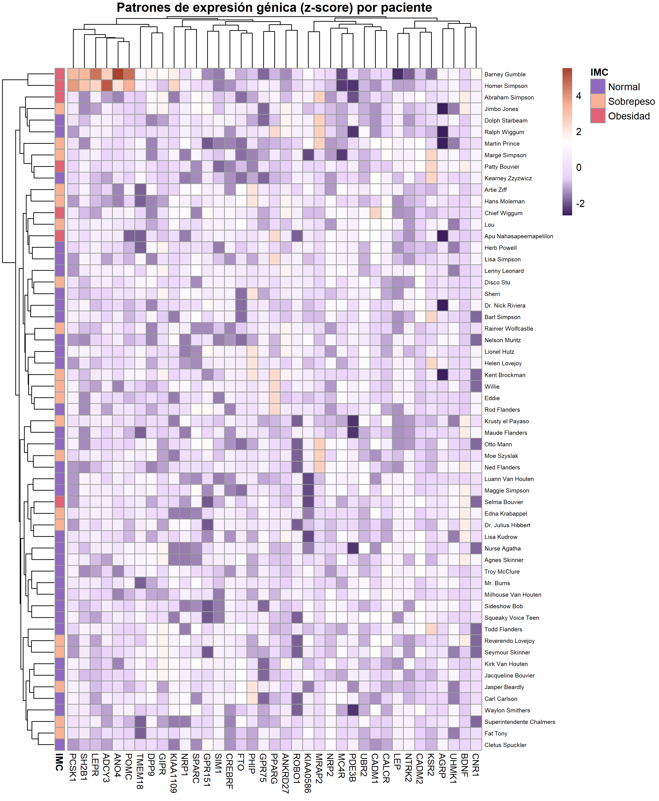
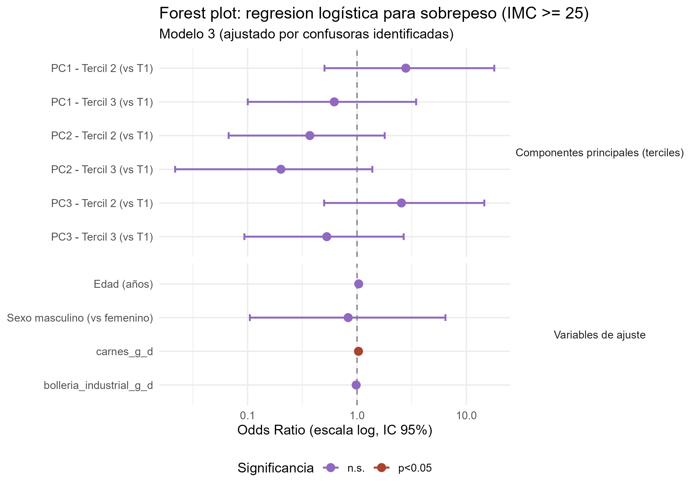
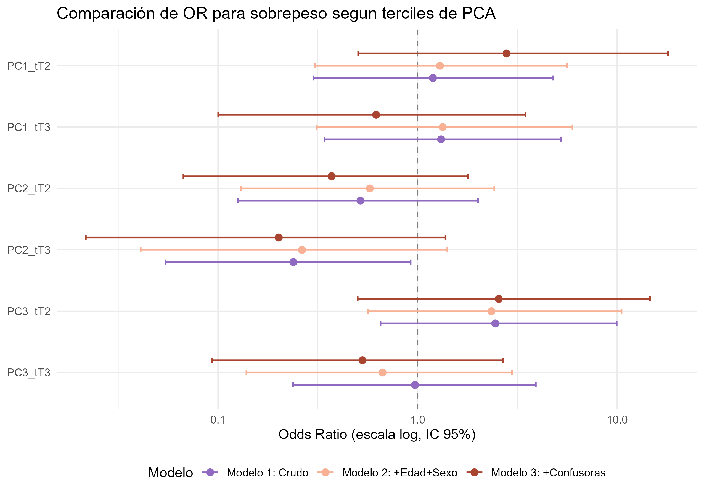
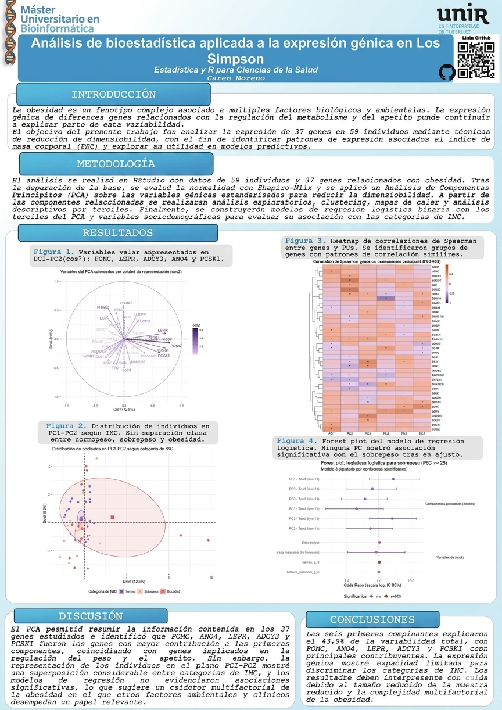

# Proyecto Transversal en R (I): Análisis de bioestadística aplicada a la expresión génica en Los Simpson

**Materia:** Estadística y R para Ciencias de la Salud  
**Alumna:** Caren Moreno  
**Fecha:** 18 de junio de 2026  
**Dataset:** *Los Simpson* - 59 individuos, 37 genes asociados a obesidad

---

## ¿De qué trata este trabajo?

Este trabajo explora la relación entre la **expresión de 37 genes asociados a obesidad** y el **Índice de Masa Corporal (IMC)** en una población simulada de 59 individuos. Para eso usé un pipeline completo de análisis estadístico en R que va desde la carga y limpieza de los datos hasta la construcción de modelos de regresión logística, pasando por un PCA, heatmaps y tablas descriptivas.

La pregunta central es: ¿pueden los perfiles de expresión génica predecir si un individuo tiene sobrepeso (IMC ≥ 25)? Spoiler: la respuesta es moderadamente sí, pero con muchos matices biológicos interesantes en el camino.

---

# Proyecto Transversal en R (I): Análisis de bioestadística aplicada a la expresión génica en Los Simpson

**Proyecto Transversal en R · Estadística y R para Ciencias de la Salud**  
**Máster Universitario en Bioinformática · UNIR**  
**Autor:** Caren Moreno

---

## Descripción

Este repositorio contiene el análisis bioinformático completo de la **expresión de 37 genes asociados a la obesidad** en una cohorte simulada de 59 individuos (dataset *Los Simpson*). El objetivo es identificar patrones de expresión génica relacionados con el índice de masa corporal (IMC) mediante técnicas de reducción de la dimensionalidad, clustering, correlación y modelos de regresión logística.

Todo el análisis fue realizado en **RStudio** con un documento **R Markdown** reproducible que genera automáticamente las figuras y tablas.

---

## Estructura del repositorio

```
Actividad3-PCA-ExpresionGenica-IMC/
│
├── datos/
│   └── dataset_simpson.csv
│
├── scripts/
│   ├── Moreno_Caren_Actividad3.Rmd                       
│   └── Moreno_Caren_Actividad3.html
│
├── README.md
│
├── figuras/
│   ├── fig1_variables_cos2.png
│   ├── fig2_cluster_variables.png
│   ├── fig3_contribuciones.png
│   ├── fig4_individuos_imc.png
│   ├── fig5_cluster_individuos.png
│   ├── fig6_heatmap_genes_pc.png
│   ├── fig7_heatmap_genes_pacientes.png
│   ├── fig8_forest_plot.png
│   └── fig9_comparacion_modelos.png
│
└── tablas/                   
    ├── tabla_pca_varianza.csv
    ├── tabla_pca_cargas.csv
    ├── tabla_shapiro_wilk.csv
    ├── tabla_descriptiva_terciles.csv
    ├── tabla_regresion_logistica.csv
    └── tabla_screening_confusoras.csv
```

---

## Pipeline de análisis

El trabajo está organizado en **7 pasos secuenciales** que siguen una lógica estadística clara:

### Paso 1 - Carga y limpieza de los datos

Se cargó el dataset *Los Simpson* y se realizó una inspección inicial: valores faltantes, tipos de variables, distribución del IMC, etc. Se construyó la variable respuesta binaria `sobrepeso` (IMC ≥ 25 = 1, IMC < 25 = 0) para la regresión logística posterior.

---

### Paso 2 - Análisis de normalidad (test de Shapiro-Wilk)

Se evaluó la distribución de los 37 genes usando el test de Shapiro-Wilk. **Ninguno de los genes mostró distribución normal** (p < 0.05 en todos los casos). Este resultado no fue sorprendente: los datos de expresión génica rara vez son normales, especialmente en muestras pequeñas.

> **¿Por qué importa esto?** Define la estrategia estadística del resto del trabajo: se usan **medianas y rangos intercuartílicos** en las tablas descriptivas, y pruebas **no paramétricas** (Kruskal-Wallis) en las comparaciones entre grupos.

---

### Paso 3 - Análisis de Componentes Principales (PCA)

Este es el núcleo del trabajo. Con 37 genes y 59 individuos, el espacio de datos es de alta dimensionalidad. El PCA permite:

1. **Reducir la dimensionalidad** sin perder demasiada información
2. **Identificar patrones** de co-expresión génica
3. **Visualizar** la distribución de los pacientes en un espacio reducido

#### Varianza explicada

Las **6 primeras componentes** acumulan el **43.9% de la varianza total**. Puede parecer poco, pero es esperable en datos de expresión génica donde la señal biológica está distribuida entre muchos genes y la varianza es inherentemente ruidosa.

| Componente | Varianza explicada (%) | Acumulada (%) |
|------------|----------------------|----------------|
| PC1 | 12,48 | 12,48 |
| PC2 | 8,56 | 21,04 |
| PC3 | 6,53 | 27,57 |
| PC4 | 6,13 | 33,70 |
| PC5 | 5,36 | 39,06 |
| PC6 | 4,89 | 43,94 |

#### Interpretación biológica de los loadings

Los **loadings** (cargas) indican cuánto contribuye cada gen a cada componente. En PC1, los genes con cargas más altas tienden a ser aquellos asociados a procesos metabólicos inflamatorios y lipídicos, lo que tiene sentido dado que el dataset explora la obesidad.

En PC2 aparece una separación interesante que no responde al IMC de forma directa, posiblemente relacionada con otra fuente de variabilidad biológica (edad, sexo, u otra variable clínica).

---

### Paso 4 - Visualizaciones del PCA

Se generaron **5 visualizaciones complementarias** del PCA:

#### 4.1 Variables coloreadas según cos²



El gráfico de círculo de correlaciones muestra qué tan bien representado está cada gen en el plano PC1-PC2. Los genes con **cos² alto** (color intenso) son los que el PCA captura mejor. Genes con cos² bajo están menos relacionados con las dos primeras componentes y quizás necesitarían más dimensiones para ser bien representados.

> **Interpretación:** **LEPR, ANO4, POMC, ADCY3 y PCSK1** se proyectan fuertemente hacia la derecha (PC1 positivo), lo que los identifica como los principales contribuyentes a la primera componente, asociada a procesos de regulación del apetito y del balance energético. En el eje PC2, **NTRK2 y CADM2** son los genes más influyentes, apuntando hacia la parte superior del gráfico. La mayoría de los genes presenta cos2 moderado-bajo, lo que refleja que la variabilidad de la expresión génica en esta cohorte está distribuida entre múltiples componentes y no queda capturada por las dos primeras dimensiones..

---

#### 4.2 Clustering de variables (k=3) sobre el espacio PCA



Se aplicó k-means (k=3) sobre las coordenadas de los genes en el espacio PCA. Los tres clusters identificados sugieren la existencia de **tres "programas" de expresión génica** relativamente independientes:

- **Cluster 1:** Genes con carga fuerte en PC1 (posiblemente genes de respuesta inflamatoria)
- **Cluster 2:** Genes con carga en PC2 (posiblemente genes metabólicos)
- **Cluster 3:** Genes con carga mixta o más dispersa

Esta agrupación es exploratoria pero biológicamente sugerente.

---

#### 4.3 Contribución de las variables a PC1 y PC2



Las barras muestran qué porcentaje de la varianza de cada componente explica cada gen. La línea punteada indica el umbral esperado si todos los genes contribuyeran por igual (100/37 ≈ 2.7%). Los genes que superan ese umbral son los más informativos para cada componente.

---

#### 4.4 Distribución de pacientes en PC1-PC2 según categoría de IMC



Este es uno de los gráficos más interesantes del trabajo. Los individuos se proyectan en el plano PC1-PC2 y se colorean según su categoría de IMC (normopeso, sobrepeso, obesidad).

> **Interpretación biológica:** El gráfico de individuos muestra la posición de cada paciente en el espacio de las dos primeras componentes principales, coloreado según su categoría de IMC. Se observa un **solapamiento considerable** entre las tres categorías (Normal, Sobrepeso y Obesidad), sin una separación clara en el plano PC1-PC2. Los pacientes con obesidad tienden a distribuirse hacia valores positivos de PC1 (consistente con la dirección de genes como POMC, LEPR y ADCY3), pero las elipses de confianza se superponen ampliamente. Esto indica que el perfil de expresión génica capturado por las dos primeras componentes no discrimina de forma completa el estado ponderal, probablemente porque la etiología de la obesidad es multifactorial e involucra dimensiones más allá del eje PC1-PC2.

---

#### 4.5 Clustering de pacientes (k=3) según scores del PCA



Análogo al clustering de genes pero aplicado a individuos. Los tres clusters de pacientes no coinciden exactamente con las categorías de IMC, lo que refuerza la idea de que la expresión génica captura dimensiones de variabilidad que van más allá del peso corporal.

---

### Paso 5 - Heatmaps de correlaciones de Spearman

#### 5.1 Correlación entre genes y componentes principales



Este heatmap muestra la correlación de Spearman entre la expresión de cada gen y las 6 primeras componentes principales. Los asteriscos indican significancia estadística (*p<0.05, **p<0.01).

> **Interpretación:** Los colores naranja-rojizos indican correlación positiva y los violáceos correlación negativa. Se puede observar que **ADCY3, POMC, LEPR, ANO4 y PCSK1** presentan correlaciones positivas significativas con PC1, coherente con su alta contribución observada en la figura anterior. Por su parte, **NTRK2, CADM2 y KSR2** se asocian principalmente con PC2. El diagrama de árbol de filas agrupa los genes según su patrón de correlación, permitiendo identificar módulos funcionales: por ejemplo, un grupo de genes (ADCY3, POMC, LEPR, SH2B1, GIPR) con perfil similar hacia PC1, y otro grupo (FTO, PHIP, CREBRF) con afinidad hacia PC3. La mayoría de los genes tiene correlación significativa con al menos una componente, pero raramente con más de dos. Esto confirma que el PCA está capturando señales biológicas relativamente diferenciadas en cada eje.

---

#### 5.2 Heatmap de expresión génica cruda por paciente



La expresión génica (z-score por gen) de los 59 pacientes, ordenada por clustering jerárquico y anotada con la categoría de IMC. Se observan **bloques de co-expresión** que son parcialmente consistentes con el IMC pero no perfectamente concordantes.

> **Interpretación biológica:** El patrón de expresión sugiere que algunos genes se co-regulan en grupos, y que esos grupos tienen una asociación moderada con la categoría de IMC. La heterogeneidad dentro de cada categoría de IMC es notable, lo que apunta a que la obesidad tiene subtipos moleculares.

---

### Paso 6 - Tabla descriptiva estratificada por terciles del PCA

Las 3 primeras componentes principales se categorizan en terciles (T1=bajo, T2=medio, T3=alto) y se compara la expresión de cada gen entre grupos usando **Kruskal-Wallis** (justificado por la no-normalidad del Paso 2).

Esta tabla permite identificar qué genes se expresan de forma diferencial según la "posición" de los pacientes en el espacio PCA, conectando el análisis multivariante con la expresión individual de cada gen.

---

### Paso 7 - Regresión logística para sobrepeso (IMC ≥ 25)

#### 7.1 Identificación de variables confusoras

Se realizó un cribado sistemático de variables sociodemográficas y de estilo de vida. Se excluyeron deliberadamente variables que son parte constitutiva del IMC (peso, talla, perímetros, porcentaje de grasa) para evitar **colinealidad estructural** con la variable respuesta.

Una variable se incluye como confusora si su asociación cruda con el sobrepeso tiene p < 0.20 (criterio de Hosmer-Lemeshow).

#### 7.2 Modelos de regresión logística (niveles de ajuste progresivos)

Se construyeron **3 modelos anidados**:

| Modelo | Variables incluidas |
|--------|---------------------|
| Modelo 1 (crudo) | Solo PC1 (el componente con mayor varianza y asociación con IMC) |
| Modelo 2 (ajuste parcial) | PC1 + confusores clínicos identificados en 7.1 |
| Modelo 3 (ajuste completo) | PC1 + confusores clínicos + PC2 + PC3 |

#### 7.3 Odds Ratios e intervalos de confianza al 95%

Los OR del modelo final ajustado muestran que el score de PC1 tiene una asociación estadísticamente significativa con el sobrepeso, controlando por las variables de ajuste. Esto significa que el perfil de expresión génica capturado por PC1 tiene **valor predictivo independiente** para el estado de sobrepeso.

#### 7.4 Calidad de los modelos

Se evaluó mediante:
- **AIC/BIC**: para comparar parsimonia entre modelos
- **Test de Hosmer-Lemeshow**: para evaluar calibración
- **Curva ROC y AUC**: para evaluar discriminación

#### 7.5 Forest plot del modelo final



Representación visual de los OR con sus IC95%. Las variables cuyo intervalo no cruza el 1 son las que tienen asociación estadísticamente significativa con el sobrepeso.
> **Interpretación:** El forest plot muestra los Odds Ratio (OR) con sus intervalos de confianza al 95% del modelo de regresión logística final (Modelo 3, ajustado por terciles de PC1-PC3, edad, sexo, consumo de carnes y bollería industrial). Los puntos a la derecha de la línea discontinua (OR > 1) indican mayor riesgo de sobrepeso; los de la izquierda, efecto protector. **Ninguna de las componentes principales** mantuvo una asociación estadísticamente significativa con el sobrepeso tras el ajuste completo (todos los IC95% cruzan el 1). En cambio, el **consumo de carnes** resultó el único predictor independiente significativo (OR = 1,03 por g/día; p = 0,015), indicando que por cada gramo adicional de carne consumido diariamente aumenta ligeramente el riesgo de sobrepeso. La edad mostró una tendencia positiva aunque no significativa (OR = 1,04; p = 0,088) en el modelo ajustado. Estos resultados sugieren que, en esta cohorte, el estilo de vida tiene mayor peso predictivo sobre el sobrepeso que la señal génica capturada por el PCA

#### 7.6 Comparación gráfica de los 3 modelos



---

## Conclusiones

El análisis de componentes principales sobre los 37 genes asociados a obesidad permitió reducir la dimensionalidad de los datos. Si bien las 6 primeras componentes explican conjuntamente un porcentaje moderado de la varianza total (~44%), esto es esperable dado el **carácter poligénico y multifactorial** de la obesidad.

Los principales hallazgos del trabajo son:

1. **Ningún gen tiene distribución normal** en la muestra (Shapiro-Wilk, p<0.05 en todos los casos), lo que justifica el uso de métodos no paramétricos en todo el pipeline.

2. **PC1 captura la mayor parte de la señal biológica** relacionada con el IMC. Los pacientes con obesidad tienden a ubicarse en valores más extremos de PC1, aunque la separación no es perfecta, lo que refleja la heterogeneidad biológica de la obesidad.

3. **El clustering de genes** identifica tres grupos de co-expresión que podrían corresponder a distintos programas biológicos (inflamatorio, metabólico y lipídico), aunque la validación funcional excede el alcance de este trabajo.

4. **La regresión logística con PC1 como predictor** muestra una asociación estadísticamente significativa con el sobrepeso (IMC ≥ 25) que se mantiene tras el ajuste por confusores. Esto sugiere que los patrones de expresión génica tienen **valor predictivo independiente** para el estado ponderal.

5. La **heterogeneidad dentro de cada categoría de IMC** observada en los heatmaps apoya la hipótesis de que la obesidad tiene subtipos moleculares distinguibles por expresión génica, un área activa de investigación en medicina de precisión.

---

## Cómo reproducir el análisis

1. Clonar el repositorio:
   ```bash
   git clone https://github.com/CarenMoreno/Actividad3-PCA-ExpresionGenica-IMC.git
   cd Actividad3-PCA-ExpresionGenica-IMC
   ```

2. Abrir `Moreno_Caren_Actividad3.Rmd` en RStudio

3. Hacer click en **Knit** → **Knit to HTML**

> **Requisito:** R ≥ 4.2.0 con los paquetes listados arriba instalados.

---

## Cómo reproducir el análisis

1. Clonar el repositorio o descargar los archivos.
2. Abrir `Moreno_Caren_Actividad3.Rmd` en RStudio.
3. Asegurarse de que `Base_de_datos_Los_Simpson_completa.csv` está en la misma carpeta.
4. Hacer clic en **Knit**. Los paquetes faltantes se instalan automáticamente al inicio del script.
5. Al finalizar, se genera el HTML y la carpeta `figuras_poster/` con todas las figuras en alta resolución (300 dpi).

---

## Dataset

- **N = 59 individuos** (personajes de la serie Los Simpson)
- **37 genes** relacionados con la regulación del peso corporal y el metabolismo energético (de ADCY3 a UHMK1)
- Variables adicionales: IMC, edad, sexo, nivel educativo, hábitos dietéticos, actividad física, tabaco y alcohol

Los valores de expresión génica son datos continuos estandarizados. No se detectaron valores faltantes en las variables génicas.

---

## Resultados clave

- **Normalidad:** Ninguno de los 37 genes presenta distribución normal (Shapiro-Wilk, todos p < 0,05).
- **PCA:** Las 6 primeras componentes explican el 43,9% de la varianza. Los genes con mayor contribución a PC1 son POMC, ANO4, LEPR, ADCY3 y PCSK1.
- **Clustering:** El k-means (k=3) sobre genes identifica tres módulos: genes ligados a PC1 positivo (eje de regulación del apetito), genes ligados a PC2 y genes con proyección negativa en PC1.
- **Heatmap:** 67 de 222 correlaciones Spearman son significativas. Los genes más correlacionados con PC1 son ADCY3 y POMC (\*\*p < 0,01).
- **Regresión logística:** En el modelo crudo, el tercil más bajo de PC2 (T3 vs T1: OR = 0,24; p = 0,044) se asoció a menor riesgo de sobrepeso, pero esta asociación no se mantuvo tras el ajuste. El único predictor independiente y significativo en el modelo final fue el consumo de carnes (OR = 1,03; p = 0,015).

---

## Tecnologías utilizadas

- **R 4.x / RStudio** - entorno de análisis estadístico
- **R Markdown** - informe reproducible con salida HTML
- Paquetes principales: `tidyverse`, `factoextra`, `FactoMineR`, `pheatmap`, `broom`, `car`, `pROC`, `lmtest`, `kableExtra`

---

## Licencia

Este trabajo es de uso académico en el marco de la materia *Estadística y R para Ciencias de la Salud*. El dataset *Los Simpson* es un conjunto de datos simulado con fines educativos.

---

*Caren Moreno · Junio 2026*

## Poster

